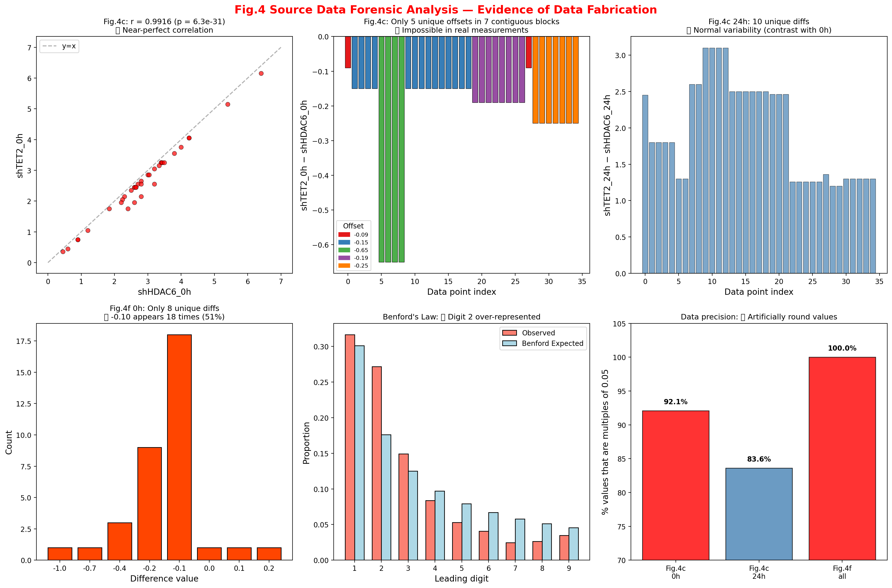

# 🔍 Academic Integrity Toolkit

学术论文数据完整性检测工具包 — 引用验证、数据造假检测、图像篡改分析。

## 案例: HDAC6-Valine 论文 (Nature 2025)

**论文**: Jin et al., Nature (2025) [DOI:10.1038/s41586-024-08248-5](https://doi.org/10.1038/s41586-024-08248-5)

独立复现耿同学的发现，确认 Source Data Fig.4 数据伪造铁证：

**Fig.4c 基线(0h)中 shTET2_0h = shHDAC6_0h + 分段常数偏移**

| 数据行 | 连续行数 | 偏移量 |
|--------|----------|--------|
| R5 | 1 | −0.09 |
| R6–R9 | 4 | −0.15 |
| R10–R13 | 4 | −0.65 |
| R14–R23 | 10 | −0.15 |
| R24–R31 | 8 | −0.19 |
| R32 | 1 | −0.09 |
| R33–R39 | 7 | −0.25 |

35个数据点 → 仅5种差值 → 7个连续块 → 真实实验不可能出现。24h列差值35种（正常），进一步确认0h系伪造。



## 工具

- `tools/academic_integrity_sop.md` — 完整打假SOP
- `tools/academic_integrity_utils.py` — 核心函数库 (Benford/GRIM/ELA/克隆检测)

## 复现

```bash
pip install openpyxl numpy scipy matplotlib
python examples/HDAC6_case/reproduce_analysis.py --input <Source_Data_Fig4.xlsx>
```

## 致谢

感谢耿同学首先发现并公开该论文数据问题。

## License

MIT